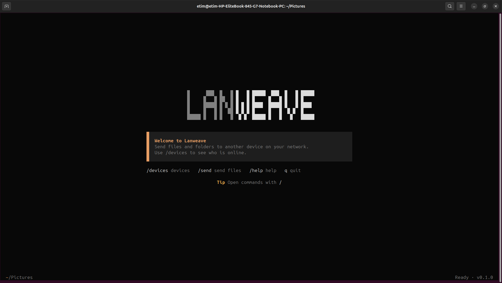
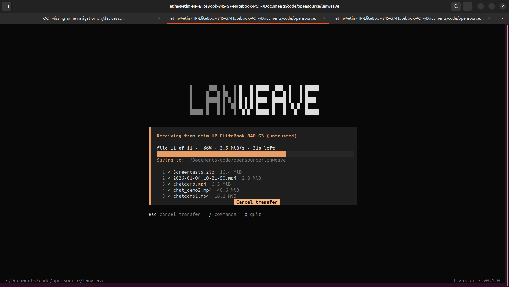

# Lanweave

<!-- SPDX-FileCopyrightText: 2026 Unyime Etim -->
<!-- SPDX-License-Identifier: Apache-2.0 -->

Lanweave is a terminal user interface (TUI) for sending files and folders to another device on the same local network. Run `lanweave` to open the app in your current terminal, then pair two devices, approve a transfer, and send files in either direction while it stays open.

**Status:** Lanweave is a work in progress. The TUI shell, live discovery, the provisional TLS 1.3 connection, the pairing request and one-time-code flow, separately approved transfers in either direction, and session lifetime handling (manual close, peer close, 10-minute idle close, and shutdown close) are available. The remaining hardening, cross-platform, and packaging work is tracked in the [implementation roadmap](docs/IMPLEMENTATION_ROADMAP.md) and the design in `docs/`.

## Install

Linux (x86_64 and arm64) and Windows (x64) builds are published as GitHub Releases. The installer places `lanweave` in `~/.lanweave/bin` and adds that directory to `PATH` when needed.

Linux:

```sh
curl --proto '=https' --tlsv1.2 -LsSf \
  https://github.com/etim66/lanweave/releases/latest/download/lanweave-installer.sh | sh
```

Windows (PowerShell):

```powershell
powershell -c "irm https://github.com/etim66/lanweave/releases/latest/download/lanweave-installer.ps1 | iex"
```

Run `/update` inside the app to check for and install a newer version. Only copies installed by the installer can update themselves; see [Updates](docs/UPDATES.md) for the details, the uninstall steps, and the trust model.

## Screenshots

The home screen, with the welcome panel and the available commands:



Receiving a file transfer, with per-file progress and cancel option:



## How It Works

1. Both users run `lanweave`. A device advertises and accepts requests only while Lanweave is running. A stale network record may remain visible briefly after an unclean exit, but the connection will fail and the record will expire.
2. User 1 opens the device list with `/devices`, selects User 2's device, and requests pairing.
3. User 2 sees the request and chooses **Accept** or **Reject**.
4. If User 2 accepts, their Lanweave app creates and displays a one-time eight-digit code. User 2 shares that code with User 1 to authorize the session.
5. User 1 enters the code. Lanweave checks the code and creates an authenticated, encrypted session between the two devices.
6. Either user can paste file or folder paths into the TUI, review them, and select **Send**. Folders are compressed into a single zip archive before the request is sent.
7. The other user sees a request with the names, sizes, count, and total size, including folder item counts, chooses the destination directory, and chooses **Accept** or **Reject** in the same dialog.
8. Accepted files are sent in order with live per-file progress. Each file is checked before it is saved under its final name.
9. Both users see a completion summary; the receiver also sees the directory the files were saved to.
10. After a transfer, either user can request another transfer in the same session, or cancel a pending or active one with the highlighted cancel button (or Escape, or `/cancel`).
11. Either user can close the session. Lanweave also closes it after 10 minutes with no transfer request or active transfer.

Closing the session removes its temporary authorization. The users must repeat the pairing and code flow before sending more files. Lanweave does not keep a trusted-device list.

## Using the App

Lanweave is interactive rather than a set of one-shot shell commands. Run `lanweave` to open the TUI; it starts on a quiet home screen that points at the available commands instead of opening the device list immediately. Press `q` outside the command palette, or Ctrl+C anywhere, to close it.

Enter `/` to open the command palette. Type to filter, use Up/Down to select, press Enter to run a command, Backspace to edit, and Escape to close it.

| Command | What it does |
| --- | --- |
| `/devices` | Opens the list of devices currently running Lanweave. Use Up/Down to select and Enter to connect. Each row shows the other computer's name, plus its network host name when names collide. Names are untrusted until pairing confirms the live connection. Escape (or `/home`) returns to the home screen. |
| `/connect` | Enters a `host:port` directly when discovery is unavailable. The address is validated before a connection can start. |
| `/send` | Opens the review list for files and folders. Paste one path per line (or a quoted path); `file://` URIs, Windows-style CRLF lists, and shell-escaped spaces are also accepted, and pasted paths are reviewed off the event loop so large folders do not block the screen. Press Enter to send, Backspace to remove the highlighted entry, and Escape to close. Pasting with no dialog open opens the review list directly. Available from the home screen, while browsing, or in an idle session, but files can only be sent from an authorized idle session. |
| `/cancel` | Cancels a pending or active transfer, including a folder that is still being compressed. A request cancelled before anything is sent returns to the session screen with a notice and keeps the reviewed files queued. |
| `/disconnect` | Closes the session. Available only while connected. |
| `/update` | Checks for a newer release. When one exists, the app shows its version and asks you to confirm before anything is downloaded; a finished update runs after you restart Lanweave. |
| `/home` | Returns to the home screen. |
| `/help` | Shows command and keyboard help. |
| `/quit` | Closes Lanweave. |

A few interactions work the same way across screens:

- A request that needs your decision appears as a highlighted dialog with buttons. Use Left/Right to move between **Accept** and **Reject** and press Enter to choose; Escape still rejects directly.
- When the peer accepts, they read the eight-digit code from their screen and you type it: digits to enter, Backspace to edit, Enter to submit, Escape to cancel. The code expires after about two minutes.
- `/cancel` (or Escape) cancels a pending or active transfer. Waiting screens show a single highlighted button, so Enter and Escape both cancel.

The exact command names may change during implementation, but `/` will always show the available actions.

## Scope

The first release will support:

- Linux, macOS, and Windows desktop terminals;
- discovery on the local network while the app is running;
- one active paired session per app;
- one active transfer request at a time;
- one or more regular files or folders in each request, where folders are sent as one zip archive;
- transfer requests in either direction during a session;
- separate approval for pairing and for every transfer;
- encrypted TCP/TLS transport with code-based peer authorization;
- safe filenames, no overwrite, bounded memory use, and partial-file cleanup;
- manual session close and a maximum 10-minute idle period; and
- no accounts, cloud service, background daemon, or trusted devices.

Directories are sent only as zip archives; resume, parallel file transfer, overwrite or rename negotiation, QUIC, mobile clients, and graphical interfaces remain outside the first release.

## Technical Shape

The first implementation is one Cargo package with a private library implementation and a thin binary entry point. Internal modules are `bootstrap`, `tui`, `app`, `session`, `protocol`, `framing`, `transport`, `pairing`, `transfer`, `storage`, `discovery`, and `update`.

Likely dependency families include:

- `ratatui` and `crossterm` for the terminal interface;
- `tokio` for asynchronous tasks;
- `rustls` and `tokio-rustls` for TLS;
- `rcgen` for a fresh certificate per connection;
- `mdns-sd` for local discovery;
- `serde` and `serde_json` for control messages;
- `sha2` for file checks; and
- `zeroize` for best-effort secret cleanup.

The pairing adapter wraps an RFC 9382 SPAKE2-P256-SHA256-HKDF-HMAC implementation (`pakery-spake2` with `pakery-crypto`) as an unaudited prototype. Lanweave must not implement cryptographic group arithmetic itself. See [Cryptography](docs/CRYPTOGRAPHY.md) for the release-blocking security work.

## Building

Lanweave requires a stable Rust toolchain at or above MSRV 1.97. Common development commands:

```sh
cargo fmt --all -- --check
cargo clippy --all-targets --locked -- -D warnings
cargo test --all --locked
cargo run --locked
cargo audit
cargo deny check
```

Run `make check` for the formatting, lint, and test gate used during normal development. The CI workflow at `.github/workflows/ci.yml` runs the same checks on Linux, macOS, and Windows.

## Documentation

| Document | Purpose |
| --- | --- |
| [Project overview](docs/PROJECT_OVERVIEW.md) | Product behavior, scope, and success criteria |
| [Protocol](docs/PROTOCOL.md) | Required connection, pairing, session, and transfer behavior |
| [Message format](docs/MESSAGE_FORMAT.md) | JSON controls, binary file frames, and limits |
| [State machines](docs/STATE_MACHINES.md) | TUI, pairing, session, and transfer states |
| [Sequence diagrams](docs/SEQUENCE_DIAGRAMS.md) | Main user and network flows |
| [Architecture](docs/ARCHITECTURE.md) | Module boundaries, events, and task ownership |
| [Discovery](docs/DISCOVERY.md) | Live device discovery and its trust limits |
| [File transfer](docs/FILE_TRANSFER.md) | File selection, approval, streaming, and cleanup |
| [Transport](docs/TRANSPORT.md) | TCP/TLS transport and session lifetime |
| [Cryptography](docs/CRYPTOGRAPHY.md) | Pairing profile and security review gates |
| [Security](docs/SECURITY.md) | Security requirements and boundaries |
| [Threat model](docs/THREAT_MODEL.md) | Threats, controls, and remaining risks |
| [Testing strategy](docs/TESTING_STRATEGY.md) | TUI, protocol, filesystem, and security tests |
| [Implementation roadmap](docs/IMPLEMENTATION_ROADMAP.md) | High-level dependency gates |
| [Releasing](docs/RELEASING.md) | Version, tag, and release workflow |
| [Updates](docs/UPDATES.md) | `/update` eligibility, behavior, and trust model |
| [Glossary](docs/GLOSSARY.md) | Plain-language project terms |

## Security Status

Lanweave is incomplete and has not been audited. It is not safe for sensitive files. The pairing adapter is an unaudited prototype around `pakery-spake2`/`pakery-crypto`; the pairing and TLS design still needs specialist review, test vectors, dependency review, and an audited RFC-conformant pairing implementation.

## Contributing and Licence

See [`CONTRIBUTING.md`](CONTRIBUTING.md) for the development workflow and module ownership guide. Design feedback is especially useful when it identifies a broken security or state rule and includes a reproducible example.

Lanweave is licensed under the Apache License, Version 2.0. See [`LICENCE`](LICENCE) for the full text and [`NOTICE`](NOTICE) for attribution.
